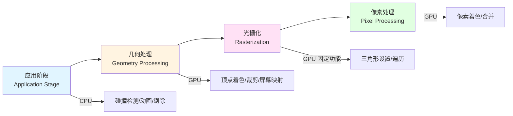

# Chapter 2 - The Graphics Rendering Pipeline (图形渲染管线)

> [!abstract] 核心概念
> 渲染管线的目标是将三维场景转换为二维图像。整条管线分为四个主要阶段：**应用阶段 → 几何处理 → 光栅化 → 像素处理**。

---

## 一、总心智模型

### 1. 直觉动机

为什么要有"管线"这个概念？因为渲染一张图要做很多不同类型的工作：更新相机、处理模型、做投影、找出三角形覆盖了哪些像素、给像素算颜色、做深度测试……如果这些工作混成一团，硬件就很难高效并行。于是就像工厂流水线一样，把任务切成多个阶段，每个阶段只负责自己的一小部分。
![[RTR4-CN.pdf#page=40&rect=57,196,535,419|RTR4-CN, p.40]]

> [!quote] 三明治流水线比喻
> 书里用"三明治流水线"举例说明：流水线能提速，但==整体速度永远受最慢那个阶段限制==，这就是"瓶颈"。

### 2. 基本定义

书中强调要区分两件事：

- **功能性阶段**：它"应该做什么"
- **实现结构**：硬件"实际上怎么做"

> [!important] 关键理解
> "应用阶段 / 几何阶段 / 光栅化 / 像素处理"是**功能划分**；真实 GPU 可能把它们合并、拆开，或者用固定功能单元与可编程核心混合实现。

### 3. 数学/工程原则

这里最核心的不是某个公式，而是一个工程思想：

> [!tip] 核心原则
> **让每一步都只处理适合它处理的数据和任务。**

比如：
- ==CPU== 更适合逻辑、碰撞、动画、场景管理
- ==GPU== 更适合海量、规则、可并行的顶点/像素计算

### 4. 在渲染流程中的作用

这章其实是整本书的"地图"。后面的 [[Chapter 3 The Graphics Processing Unit|GPU架构]]、[[Chapter 5 - Shading Basics|着色基础]]、[[Chapter 6 - Texturing|纹理]]、[[Chapter 7 - Shadows|阴影]]，几乎都是在解释这条管线上的某一段。

### 5. 简单类比

> [!example] 把渲染想成"拍照"
> - **应用阶段**：导演、场务、摄影师准备场景和机位
> - **几何阶段**：把三维场景按相机视角投到成像平面
> - **光栅化**：判断底片上哪些像素被哪个三角形覆盖
> - **像素处理**：给每个像素算颜色，并处理遮挡与混合

### 6. 常见误区

> [!warning] 误区：渲染管线 = GPU 硬件结构
> 很多初学者会以为"渲染管线 = GPU 内部真实硬件结构"。**不是。** 它首先是一个**逻辑模型**。真正硬件实现会更复杂。

---

## 二、应用阶段（Application Stage）

### 1. 直觉动机

在真正开始"画"之前，程序得先决定：相机在哪、灯光怎样、哪些物体要显示、动画播到哪一帧、用户这次鼠标拖动意味着什么。否则后面 GPU 根本不知道该处理什么。

### 2. 基本定义

应用阶段由应用程序驱动，通常运行在 ==CPU== 上。它负责：
- 碰撞检测
- 动画
- 物理模拟
- 剔除（culling）
- 输入响应
- 把要渲染的图元提交给后续阶段

> [!info] 基本图元
> 最后送进几何阶段的基本图元通常是 **点、线、三角形**。

### 3. 数学原则

这一阶段本身没有一个统一公式，但它会准备后面要用的各种矩阵和数据：

- 物体的变换矩阵
- 相机参数
- 投影矩阵
- 光照参数
- 顶点属性数据

### 4. 在管线中的作用

应用阶段回答的是：**"这一帧要画哪些东西？"**

例如书中的说明里提到，CAD 程序里用户拖动华夫饼机盖子时，应用阶段要把鼠标移动转换成旋转矩阵；相机动画也在这里更新；然后把相机、光照、模型图元信息送进几何阶段。

### 5. 例子

> [!example] 第三人称游戏场景
> 假设你在做一个第三人称游戏。玩家转动视角时：
> - CPU 更新相机位置和朝向
> - 角色骨骼动画算到新姿态
> - 做一次视锥剔除，决定哪些物体可能可见
> - 把剩下的网格发给 GPU

### 6. 常见误区

> [!danger] 误区一："应用阶段不属于渲染管线"
> 错。它虽然常在 CPU 上，但仍是整个渲染流程的第一阶段。

> [!danger] 误区二："所有事情都该放 GPU 做"
> 也不对。书里提到，虽然有些任务可用计算着色器做，但应用阶段仍然主要由 CPU 驱动。

---

## 三、几何处理阶段（Geometry Processing）

> [!abstract] 核心职责
> 这是第 2 章最核心的一部分之一。它负责把"场景中的几何"变成"可以投到屏幕上的几何"。

### 1. 直觉动机

三维模型原本在世界里有自己的位置、朝向和大小，但屏幕只认"相对于相机，它在哪里"。所以必须把顶点做变换、投影、裁剪，再放到屏幕坐标里。

![[RTR4-CN.pdf#page=42&rect=65,84,518,180|RTR4-CN, p.42]]

### 2. 基本定义

书中把几何处理阶段分成四部分：

1. [[#3.1 顶点着色 Vertex Shading|顶点着色]]
2. [[#3.2 可选的顶点处理 Optional Vertex Processing|可选的顶点处理]]
3. [[#3.3 裁剪 Clipping|裁剪]]
4. [[#3.4 屏幕映射 Screen Mapping|屏幕映射]]

---

### 3.1 顶点着色（Vertex Shading）

#### 直觉动机

每个顶点都得先知道自己在相机看来"在哪里"，还可能要携带法线、颜色、纹理坐标等信息给后面用。

#### 基本定义

顶点着色阶段会处理逐顶点操作。它不只输出顶点位置，也会输出与着色有关的数据，比如颜色、向量、纹理坐标等，供后面的光栅化插值与像素着色使用。

#### 数学原理

这里最重要的是**变换**：

- 物体从模型空间到世界/观察空间
- 再通过投影变换进入裁剪/规范化空间

![[RTR4-CN.pdf#page=44&rect=53,403,536,671|RTR4-CN, p.44]]

> [!tip] 观察变换的目的
> 把相机重新放到原点、朝向固定方向，这样后续投影和裁剪会更简单。

#### 在管线中的作用

它回答的是：**"这个顶点在相机看来在哪？它还带着哪些属性？"**

#### 例子

> [!example] 角色鼻尖顶点
> 一个顶点原来在角色模型鼻尖上。经过模型变换、观察变换、投影后，它会变成：
> - 屏幕上的一个位置候选
> - 同时带着法线、UV、颜色等，供后面插值

#### 常见误区

> [!warning] 误区："顶点着色 = 只算颜色"
> 不对。这里的"shader"不是"只做颜色"，而是对顶点做程序化处理。==位置变换通常是最核心输出==。

---

### 3.2 可选的顶点处理（Optional Vertex Processing）

#### 直觉动机

有时原始三角形太少，不够细；有时我们想从一个点生成一个小面片；有时还想把 GPU 生成的数据直接存起来。这就需要一些"可选阶段"。

#### 基本定义

书中提到的可选阶段主要包括：

| 阶段 | 功能 |
|------|------|
| **曲面细分（tessellation）** | 把较粗的输入网格细化成更多三角形 |
| **几何着色器（geometry shader）** | 以图元为输入，生成新顶点/新图元 |
| **流式输出（stream out）** | 把 GPU 处理后的结果写回 |

#### 数学原理

曲面细分的核心思想是：**根据需要增加采样密度**。书里举例说，离相机近时生成更多三角形，远时生成更少三角形。

#### 在管线中的作用

它们不是每次都开，但一旦启用，就能在几何阶段扩展或改造图元。

#### 例子

> [!example] 烟花粒子系统
> 烟花粒子一开始只是一个点。几何着色器可以把每个点扩展成一个始终朝向相机的小方片（billboard），后续再着色，看起来就像真正的火花。

#### 常见误区

> [!warning] 误区："GPU 一定只会处理现成三角形"
> 不对。它也可以在几何阶段动态生成更多图元。

---

### 3.3 裁剪（Clipping）

#### 直觉动机

相机看不见视锥体外的东西。完全看不见的图元不该浪费后续计算；部分进入视野的图元则需要把"看不见的那一段"切掉。

#### 基本定义

裁剪就是：

- 完全在可视体外：丢弃
- 完全在可视体内：保留
- 与边界相交：生成新的交点顶点，把外面的部分切掉

![[RTR4-CN.pdf#page=48&rect=66,550,516,791|RTR4-CN, p.48]]

#### 数学原理

> [!important] 关键概念
> 这一步非常重要的两个关键词是：
> 1. **齐次坐标**
> 2. **透视除法（perspective division）**

书中强调，裁剪会在投影变换后的四维齐次坐标里进行，因为透视投影下很多量直接在三维里并不是线性可插值的，必须保留那个第四分量 (w)。裁剪后再做透视除法，得到 NDC。

#### 在管线中的作用

它保证进入后续阶段的数据都处于标准化的可见体内。

#### 例子

> [!example] 线段裁剪
> 一条线段，一个端点在视锥体里，一个端点在外面。裁剪会在它与边界交点处生成一个新顶点，用这个新顶点替换外面的端点。

#### 常见误区

> [!warning] 误区："裁剪是在屏幕坐标里随便切一下"
> 不对。它依赖投影后的齐次空间，目的是保证透视正确性。

---

### 3.4 屏幕映射（Screen Mapping）

#### 直觉动机

裁剪后我们知道图元在"规范化设备坐标"里是可见的，但显示器要的是"窗口坐标/屏幕坐标"。所以还要做最后一次坐标映射。

#### 基本定义

屏幕映射阶段把 NDC 中的坐标映射到窗口区域。书里说：

- (x,y) 变成屏幕坐标
- 再加上重映射后的 (z)，三者合起来叫 **窗口坐标**
- 这些结果被送到光栅化阶段

![[RTR4-CN.pdf#page=49&rect=56,589,537,790|RTR4-CN, p.49]]

#### 数学原理

本质上就是**缩放 + 平移**：

$$
\begin{aligned}
x_{screen} &= \frac{x_{NDC} + 1}{2} \times width + x_{offset} \\
y_{screen} &= \frac{y_{NDC} + 1}{2} \times height + y_{offset}
\end{aligned}
$$

- 把 $[-1,1]$ 范围映到窗口的左下角和右上角之间
- 把深度重新映射到深度缓冲使用的范围

#### 在管线中的作用

它把"抽象的标准空间"变成"真实屏幕上的像素空间"。

#### 例子

NDC 中点 $(0,0)$ 通常会映射到视口中央。

#### 常见误区

> [!warning] 误区："投影做完就直接得到像素坐标"
> 不是。投影之后还要经过裁剪、透视除法和视口/窗口映射。

---

## 四、光栅化阶段（Rasterization）

### 1. 直觉动机

前面我们一直在处理"顶点"和"三角形"。但显示器最终只认识像素。于是必须回答：

> [!question] 核心问题
> **这个三角形到底覆盖了哪些像素？**

![[RTR4-CN.pdf#page=50&rect=54,337,533,501|RTR4-CN, p.50]]
### 2. 基本定义

光栅化阶段会把图元转换成一批片元（fragment）。书中将它分成：

- [[#4.1 三角形设置 Triangle Setup|三角形设置（triangle setup）]]
- [[#4.2 三角形遍历 Triangle Traversal|三角形遍历（triangle traversal）]]

### 3. 数学原理

这里最核心的数学是**覆盖测试与插值**。

书中提到，覆盖判定可以基于像素中心采样，也可以做超采样/MSAA，甚至保守光栅化。之后会对顶点属性做插值，并且在透视投影下要做**透视正确插值**。

### 4. 作用

它把"连续几何"转成"离散样本/像素候选"。

---

### 4.1 三角形设置（Triangle Setup）

#### 直觉动机

为了高效判断"某个像素在不在三角形里"，要先把三角形的一些辅助数据算好。

#### 定义

书里说，这一阶段会计算三角形的微分、边界方程等数据，供后续遍历和插值使用，一般由固定功能硬件实现。

#### 例子

> [!tip] 考试答案模板
> 你可以把它理解成"先把三角形的考试答案模板准备好"，后面每个像素来套模板，判断是否在内部。

---

### 4.2 三角形遍历（Triangle Traversal）

#### 直觉动机

接下来就一格格检查像素：哪些像素被这个三角形盖住了？

#### 定义

这一阶段会检查所有被三角形覆盖的像素或样本，生成对应片元，并对顶点属性做插值，得到每个片元的深度和着色数据。

#### 数学原理

这里的插值很关键。初学者要记住一句话：

> [!important] 关键原则
> **顶点属性不是"复制"到像素，而是"插值"到像素。**

位置、法线、颜色、UV 等都会从顶点传播到片元。透视投影下不是普通线性插值，而要做透视正确插值。

#### 常见误区

> [!warning] 误区："三角形内部所有像素的颜色都一样"
> 不对。颜色、法线、UV 通常都在三角形内部连续变化。

---

## 五、像素处理阶段（Pixel Processing）

### 1. 直觉动机

光栅化只告诉你"这个像素可能属于某个三角形"。但这个像素到底是什么颜色、是否被挡住、要不要和背景混合，还没决定。

### 2. 基本定义

像素处理阶段分成：

- [[#5.1 像素着色 Pixel Shading|像素着色（pixel shading）]]
- [[#5.2 合并 Merging ROP|合并（merging）]]

---

### 5.1 像素着色（Pixel Shading）

#### 直觉动机

顶点只给了稀疏信息，真正细致的表面外观通常要到每个像素上再算。

#### 基本定义

像素着色阶段以插值得到的片元数据为输入，执行逐像素着色程序，输出颜色值。书中特别强调：像素着色由==可编程 GPU 核心==执行，程序员编写像素着色器/片元着色器。

#### 数学原理

这里会计算各种着色方程，最常见的一个输入来源是**纹理**。书里把纹理化形象地描述为把图像"粘"到物体表面。

#### 作用

它回答的是：**"这个片元应该长什么样？"**

#### 例子

> [!example] 龙模型纹理
> 龙模型本身只有几何形状，贴上纹理之后，鳞片、颜色变化、细节才真正出现。

![[RTR4-CN.pdf#page=52&rect=84,510,509,800|RTR4-CN, p.52]]

#### 常见误区

> [!warning] 误区："像素着色只做纹理采样"
> 不对。纹理只是常见操作之一，它本质上是一个可编程着色计算阶段。

---

### 5.2 合并（Merging / ROP）

#### 直觉动机

即便算出了一个片元的颜色，也不能马上写屏幕。因为同一个像素位置可能有多个片元竞争，必须决定谁可见、谁被挡住、是否要混合。

#### 基本定义

合并阶段会把片元结果与颜色缓冲、深度缓冲、模板缓冲等结合，执行深度测试、模板测试、颜色写入与混合。书里把它称为 ROP 或 render output unit。

#### 数学原理

这里最关键的是 ==z-buffer（深度缓冲）==：

- 每个像素存一个当前最近的深度
- 新片元来了，就比较深度
- 更近就覆盖，更远就丢弃

> [!tip] 为什么不透明物体可以任意顺序渲染
> 这就是不透明物体通常能按任意顺序渲染的原因：最后更近的会留下来。

> [!warning] 透明物体是 z-buffer 的弱点
> 书中也指出，**透明物体是 z-buffer 的弱点之一**，因为透明通常需要从后往前排序，或者使用顺序无关透明（OIT）算法。

#### 在管线中的作用

它回答的是：**"这个片元最终能不能进入帧缓冲？"**

#### 例子

> [!example] 墙与树的遮挡
> 前面一堵墙、后面一棵树。树片元先算出来也没关系；如果墙更近，z-buffer 会让墙留下，树被挡住。

#### 常见误区

> [!danger] 误区一："像素着色完就一定显示在屏幕上"
> 错。它还可能被深度测试、模板测试或混合规则拒掉。

> [!danger] 误区二："透明也能像不透明一样随便画"
> 一般不行。透明渲染通常对顺序敏感。

---

## 六、整条管线串起来看

现在你应该把整条流程看成下面这个故事：

1. **应用阶段**：CPU 更新相机、动画、模型状态，挑出这一帧要送去渲染的图元
2. **几何处理阶段**：GPU 把顶点变换到相机空间/投影空间，做顶点着色、裁剪，并映射到窗口坐标
3. **光栅化阶段**：找出哪些像素被图元覆盖，生成片元，并对属性进行插值
4. **像素处理阶段**：为片元计算颜色，做深度/模板/混合，最后更新帧缓冲

---

## 七、核心要点总结

> [!success] 这章最该记住的 8 句话
>
> 1. **渲染管线的目标，是把三维场景变成二维图像。**
> 2. **整条管线大致分为应用、几何处理、光栅化、像素处理四大阶段。**
> 3. **应用阶段主要在 CPU，上游决定"画什么"。**
> 4. **几何处理阶段主要解决"顶点在哪里"。**
> 5. **裁剪是为了只保留可见体内的图元，并在齐次空间中保证透视正确性。**
> 6. **光栅化是把三角形变成片元。**
> 7. **像素着色决定外观，合并决定可见性与最终写入。**
> 8. **整条链条的性能取决于最慢的阶段，也就是瓶颈。**

---

## 八、容易混淆的概念

### "顶点着色"和"像素着色"谁更重要？

> [!note] 都重要，但职责不同
> - **顶点着色**：处理离散顶点
> - **像素着色**：处理屏幕上的片元/像素

### "片元"就是"像素"吗？

> [!faq] 不完全一样
> **片元（Fragment）** 是"一个候选像素样本"，它还没经过最终的深度/模板/混合判定。只有通过了所有测试，才会成为最终显示的像素。

### "裁剪"和"剔除"一样吗？

| 概念 | 定义 |
|------|------|
| **剔除（Culling）** | 整个物体/图元直接不要了 |
| **裁剪（Clipping）** | 图元一部分保留、一部分切掉 |

### "z-buffer"解决了所有可见性问题吗？

> [!tip] 对不透明物体很强，但对透明物体不够
> - **不透明物体**：z-buffer 工作得很好
> - **透明物体**：需要特殊处理（排序或 OIT 算法）

---

## 九、相关章节链接

- [[Chapter 1 - Introduction|第一章：简介]]
- [[Chapter 3 The Graphics Processing Unit|第三章：图形处理单元]]
- [[Chapter 4 - Transforms|第四章：变换]]
- [[Chapter 5 - Shading Basics|第五章：着色基础]]
- [[Chapter 6 - Texturing|第六章：纹理]]

---

#RTR4th #rendering #graphics-pipeline #GPU
