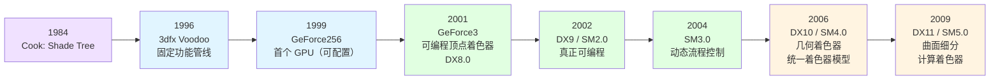
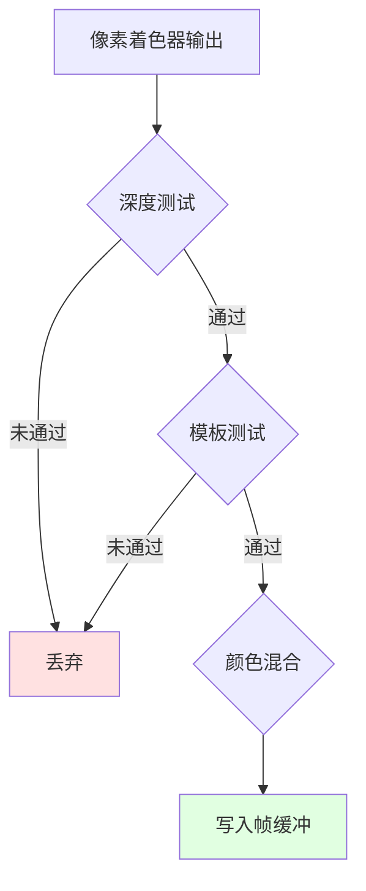

# Chapter 3 The Graphics Processing Unit (图形处理单元)

> [!quote] 黄仁勋
> "The display is the computer." — Jen-Hsun Huang

> [!abstract] 核心概念
> GPU 不是"更快的 CPU"，而是"为了==高吞吐并行任务==而专门设计的处理器"。本章的主线是理解 GPU 的架构哲学、着色器执行模型，以及渲染管线中各硬件阶段的职责。

---

## 本章心智模型

### 直觉动机

如果说 [[Chapter 2 The Graphics Rendering Pipeline|第 2 章]]讲的是"渲染管线在逻辑上分成哪些阶段"，那么第 3 章回答的是：

> [!question] 核心问题
> **这些阶段为什么适合在 GPU 上跑？GPU 到底是怎么把这些工作高吞吐地并行做掉的？**

### 本章结构

```mermaid
graph LR
    A["3.1 数据并行结构<br/>GPU 为什么快"] --> B["3.2 GPU 管线概述<br/>硬件阶段划分"]
    B --> C["3.3 可编程着色器阶段<br/>统一编程模型"]
    C --> D["3.4 API 演变<br/>历史脉络"]
    D --> E["3.5 顶点着色器"]
    E --> F["3.6 曲面细分"]
    F --> G["3.7 几何着色器<br/>+ 流式输出"]
    G --> H["3.8 像素着色器"]
    H --> I["3.9 合并阶段"]
    I --> J["3.10 计算着色器"]

    style A fill:#e1f5ff
    style B fill:#fff4e1
    style C fill:#ffe1f5
    style D fill:#f0e1ff
    style E fill:#e1ffe1
    style F fill:#e1ffe1
    style G fill:#e1ffe1
    style H fill:#e1ffe1
    style I fill:#fff4e1
    style J fill:#e1f5ff
```

### 常见误区

> [!warning] 误区：GPU = 很多 CPU 核心拼起来
> GPU 的组织方式、调度方式、访存哲学和 CPU 都不同。CPU 靠"聪明"减少等待；GPU 靠"人多"隐藏等待。

---

## 3.1 数据并行结构

### 核心问题：如何应对延迟？

所有处理器都面临一个共同问题：==访存延迟（latency）==。数据离处理器越远，访问就越慢；等待数据时，处理器停滞，性能下降。

### CPU vs GPU：两种哲学

| 维度       | CPU               | GPU                  |
| -------- | ----------------- | -------------------- |
| **优化目标** | 单线程性能（低延迟）        | 吞吐量（高吞吐）             |
| **芯片面积** | 大部分是高速缓存          | 大量着色器核心（shader core） |
| **应对延迟** | 尽量避免停滞            | 用切换隐藏停滞              |
| **擅长**   | 复杂程序、不规则数据、分支多的代码 | 大量相似、独立的数据并行任务       |

**CPU 的策略**——"让当前线程不要等"：

- 大量高速缓存（cache）
- 分支预测（branch prediction）
- 指令重排序（instruction reordering）
- 寄存器重命名（register renaming）
- 缓存预取（prefetching）

**GPU 的策略**——"如果这批线程在等，就立刻换另一批"：

- GPU 是一个==流处理器（stream processor）==，依次处理有序的相似数据
- 芯片大部分面积是数千个着色器核心
- 着色器调用之间尽可能独立

> [!tip] 一句话对比
> **CPU 用"聪明"减少等待；GPU 用"人多"隐藏等待。**

![[RTR4-CN.pdf#page=61&rect=49,235,534,795|RTR4-CN, p.61]]
### 核心概念：线程、Warp、SIMD

#### 线程（Thread）

在 GPU 里，一个着色器调用（shader invocation）通常被看成一个线程。它和 CPU 线程不同，更多是"一个独立执行实例"，包含输入数据的存储空间和执行所需的寄存器空间。

#### Warp / Wavefront

很多执行相同着色器程序的线程被打包成一组：

| 厂商 | 名称 | 线程数 |
|------|------|--------|
| NVIDIA | ==warp== | 32 |
| AMD | ==wavefront== | 通常 64 |

一个 warp / wavefront 负责调度一组 GPU 处理核心。

#### SIMD Lane

Warp 中的每个线程映射到一个 **SIMD 通道（SIMD lane）**，所有 lane 以固定步长执行==完全相同的指令==。

> [!example] 2000 个线程如何分配？
> 假设有 2000 个线程，NVIDIA 的一个 warp 有 32 个线程：
>
> $$\frac{2000}{32} = 62.5$$
>
> 需要 **63 个 warp**，最后一个 warp 只装满了一半。
>
> 这说明 GPU 不是逐线程调度，而是按 warp 这种"成组"单位运行的。

### Warp 切换如何隐藏延迟？

同一个 warp 里的线程执行相同指令。当遇到存储读取，整组都会等返回结果。此时 GPU 可以立刻切换到另一个 warp。

> [!important] 关键点
> Warp 切换非常快，因为每个线程的寄存器状态都已保留。交换 warp 只是"将一组处理器核心指向另一组线程"，没有额外开销。

### 占用率（Occupancy）

> [!note] 定义
> **占用率** = GPU 上同时驻留的 in-flight warp 数量。

- 占用率越高 → 可调度 warp 越多 → 隐藏延迟能力越强
- 占用率低 → 手头没有备用工作 → 处理器空等

### 寄存器对性能的影响

> [!warning] 寄存器越多 ≠ 性能越好
> 每个线程使用的寄存器越多 → GPU 同时容纳的线程/warp 越少 → occupancy 下降 → 隐藏延迟能力变差 → 性能可能下降。

所以着色器编程中需要平衡寄存器使用量。

### 线程发散（Thread Divergence）

这是本章最重要的性能概念之一。

如果一个 warp 中的所有线程都走同一分支 → 没问题。

如果有些线程走 `if`，另一些走 `else` → warp 必须把**两条分支都执行一遍**，再按线程挑选结果。

> [!danger] 线程发散
> **GPU 最怕同一 warp 内部的线程走不同代码路径。** 一些线程需要去执行循环或进入了其他线程未进入的 `if` 分支，会导致其余线程空转。

---

## 3.2 GPU 管线概述

### 逻辑模型 vs 物理模型

> [!important] 关键区分
> - **逻辑模型（logical model）**：API 暴露给程序员看的管线结构
> - **物理模型（physical model）**：硬件厂商的实际实现方式

逻辑模型中的某个固定功能阶段，可能通过给相邻可编程阶段添加指令来实现。==不要把逻辑模型误认为真实硬件结构。==

![[RTR4-CN.pdf#page=63&rect=49,530,538,678|RTR4-CN, p.63]]

### 各阶段的可控程度

| 颜色    | 含义       | 例子                |
| ----- | -------- | ----------------- |
| 🟢 绿色 | 完全可编程    | 顶点着色器、像素着色器、几何着色器 |
| 🟡 黄色 | 可配置但不可编程 | 合并阶段（可设置混合模式）     |
| 🔵 蓝色 | 固定功能     | 裁剪、三角形设置/遍历       |
| 虚线边框  | 可选       | 曲面细分、几何着色器        |

### 与第 2 章的关系

> [!tip] 两层视角
> [[Chapter 2 The Graphics Rendering Pipeline|第 2 章]]的"渲染管线"是==功能视角==，第 3 章的"GPU 管线"是==硬件/API 视角==。

---

## 3.3 可编程着色器阶段

### 统一着色器架构

现代 GPU 采用==统一着色器设计（unified shader design）==：

- 顶点、像素、几何、曲面细分着色器共享通用编程模型
- 相同的指令集架构（ISA）
- GPU 可以视情况平衡各阶段负载

> [!example] 负载均衡
> 一组大量微小三角形组成的网格需要更多顶点着色处理。独立着色器核心池需要预设比例，而统一着色器核心可以根据负载动态分配。

### Draw Call

> [!note] 定义
> **Draw call** = 一次"请 GPU 画这一批东西"的命令。它会调用图形 API 绘制一组图元，渲染管线执行对应的着色器。

### 两类输入

| 类型 | 说明 | 例子 |
|------|------|------|
| **统一输入（uniform）** | 一次 draw call 中不变 | 光源颜色、变换矩阵、材质参数 |
| **可变输入（varying）** | 随顶点/片元变化 | 顶点位置、法线、UV、光栅化插值属性 |

> [!tip] 纹理的本质
> 纹理是一种特殊的统一输入。过去把它当颜色图像，现在它可以是==任意阵列数据==。纹理本质上是 GPU 高效访问的数据容器。

### 着色器虚拟机的寄存器

| 寄存器类型 | 用途 |
|------------|------|
| 常量寄存器（constant register） | 存储统一输入 |
| 可变寄存器 | 存储可变输入/输出 |
| 临时寄存器（temporary register） | 通用临时存储 |

统一输入只需一次 draw call 存一份，被所有调用复用；可变输入/输出则是每顶点/每像素独立的。

![[RTR4-CN.pdf#page=65&rect=85,212,497,545|RTR4-CN, p.65]]

### 流程控制：静态 vs 动态

| 类型 | 分支依据 | 线程发散 | 性能 |
|------|----------|----------|------|
| **静态流程控制** | uniform 值 | ❌ 不会 | 好 |
| **动态流程控制** | varying 值 | ✅ 容易 | 差 |

> [!important] 记忆方法
> - **uniform 决定分支** → 通常整齐，没有线程发散
> - **varying 决定分支** → 通常危险，容易导致线程发散

---

## 3.4 可编程着色及其 API 的演变

### 时间线总览

### 关键里程碑

| 时间 | 事件 | 意义 |
|------|------|------|
| 1984 | Cook 提出 shade tree | 可编程着色的思想源头 |
| 1996 | 3dfx Voodoo | 消费级图形硬件，固定功能管线 |
| 1999 | NVIDIA GeForce256 | 首个被称为 GPU 的硬件（==可配置==，非可编程） |
| 2001 | GeForce3 + DX8.0 | 首个==可编程顶点着色器==；像素着色器受限于 12 条指令 |
| 2002 | DX9 / SM2.0 | 真正可编程：依赖纹理读取 + 16 位浮点 + 流程控制 |
| 2004 | SM3.0 | 动态流程控制，顶点着色器有限纹理读取 |
| 2006 | DX10 / SM4.0 | 几何着色器、流式输出、==统一着色器编程模型== |

> [!important] "真正可编程"的两要素
> Peercy 等人指出，着色器真正可编程需要：
> 1. ==依赖纹理读取（dependent texture reads）==
> 2. ==浮点数据==

### 着色语言

| API | 着色语言 | 备注 |
|-----|----------|------|
| DirectX | HLSL | Microsoft + NVIDIA 开发 |
| OpenGL | GLSL | ARB 推出 |
| Metal | Metal Shading Language | Apple 自有 |
| Vulkan | SPIR-V | Khronos，跨平台 |

这些语言都深受 ==C 语言风格==影响，同时包含 RenderMan 着色语言的元素。

### 低开销 API 时代

| API | 年份 | 特点 |
|-----|------|------|
| AMD Mantle | 2013 | 首创低开销驱动 |
| DirectX 12 | 2015 | 重构 API，更好映射现代 GPU |
| Metal | 2014 | Apple 推出，降低 CPU 占用和功耗 |
| Vulkan | 2016 | 跨平台，SPIR-V 中间语言 |

> [!note] 移动端
> 移动设备使用 **OpenGL ES**（ES = 嵌入式系统）。WebGL 是基于浏览器的 OpenGL ES 分支，适合教学和实验。

---

## 3.5 顶点着色器（Vertex Shader）

### 定义

顶点着色器是 GPU 管线中程序员可以直接控制的==第一个阶段==。

> [!warning] 为什么叫"顶点着色器"？
> 早期因为经常在逐顶点阶段算颜色而得名。但现代 GPU 中，顶点着色器已经是一个更通用的阶段，不一定真的做"着色"。==位置变换通常是最核心的输出。==

### 核心职责

- 处理传入的每个顶点（==无法创建或销毁顶点==）
- 一个顶点的计算结果无法传递给另一个顶点
- 通常将顶点从模型空间变换到齐次裁剪空间

### 顶点空间变换主线

> [!tip] 这条链为 [[Chapter 4 Transform|第 4 章：变换]]做铺垫。

### 顶点法线

三角形网格通常用来表示一个==潜在曲面==。顶点法线表示的是这个曲面的朝向，而不是三角形网格本身的朝向。

![[RTR4-CN.pdf#page=72&rect=49,573,543,792|RTR4-CN, p.72]]

### 实例化（Instancing）

> [!example] 实例化
> 同一个模型可以配不同的模型变换矩阵，在场景中放多个副本，而不需要复制模型本身。所有绘制只对应一次 draw call。

### 典型应用

- 物体生成：创建一次模型，通过顶点着色器变形
- 蒙皮技术 / 变形技术：角色身体动画、面部动画
- 程序化变形：旗帜、布料、水面
- 粒子创建：发送简并网格模拟粒子
- 透镜畸变、热雾、水波纹等特效
- 地形高度场

![[RTR4-CN.pdf#page=73&rect=59,439,521,611|RTR4-CN, p.73]]

## 3.6 曲面细分阶段（Tessellation）

### 动机

> [!question] 为什么需要曲面细分？
> - 物体离相机远 → 只占几个像素 → 密集三角形浪费
> - 物体离相机近 → 三角形太少 → 显得粗糙
>
> 曲面细分的目标：**根据需要动态生成"合适数量"的三角形。**

![[RTR4-CN.pdf#page=74&rect=41,206,541,550|RTR4-CN, p.74]]

### 三个子阶段

| DirectX 名称              | OpenGL 名称 | 功能              |
| ----------------------- | --------- | --------------- |
| **壳着色器**（hull shader）   | 细分控制着色器   | 确定细分因子，处理控制点    |
| **曲面细分器**（tessellator）  | 图元生成器     | 固定功能，生成新顶点和重心坐标 |
| **域着色器**（domain shader） | 细分评估着色器   | 用控制点计算输出顶点      |

### 细分因子

- **内边缘因子**：决定三角形/四边形内部的细分次数
- **外边缘因子**：决定每个外部边缘被分割的次数

> [!tip] LOD 思想
> 对参数的分开控制可以让相邻曲面边界匹配，避免裂缝。这是一种典型的 ==LOD（细节层次）==思想，在 GPU 几何阶段实现。

![[RTR4-CN.pdf#page=75&rect=53,517,535,653|RTR4-CN, p.75]]

### 好处

- 曲面描述比三角形网格更紧凑，节省内存和带宽
- 可根据相机距离动态调整三角形数量
- 可在低性能 GPU 上降低质量以保持帧率
- 平坦表面可细分后弯曲变形

---

## 3.7 几何着色器（Geometry Shader）

### 基本功能

几何着色器接收图元作为输入（点、线、三角形），可以：

- 操作图元顶点
- 销毁图元
- 创建新图元（输出 0 个或更多顶点）

![[RTR4-CN.pdf#page=76&rect=105,239,489,395|RTR4-CN, p.76]]

> [!warning] 性能注意
> 几何着色器保证按输入顺序输出图元，这意味着需要保存和排序结果，不利于大量复制或创建图元。在实践中==几何着色器很少被使用==，因为它和 GPU 并行计算的优势并不相符。

### 与曲面细分的区别

| 维度 | 曲面细分 | 几何着色器 |
|------|----------|------------|
| 生成能力 | 强（固定功能硬件） | 有限 |
| 输出图元 | 大量三角形 | 有限数量 |
| 并行友好 | ✅ | ❌（需保序） |

### 典型应用

> [!example] Billboard / 粒子
> 烟花的每个火花一开始只是一个点。几何着色器可以把每个点变成一个始终面向观察者的小方片（billboard，由两个三角形组成）。

其他用途：立方体贴图六面同时渲染、级联阴影贴图（CSM）、毛发鳍片、边缘检测等。

![[RTR4-CN.pdf#page=77&rect=55,371,535,589|RTR4-CN, p.77]]

## 3.7.1 流式输出（Stream Output）

### 核心思想

> [!note] 定义
> 流式输出允许把 GPU 处理后的几何结果==写出来保存==，而不是只让它继续往后渲染。

通常 GPU 算完就直接画出来；流式输出允许先存起来以后再用。

### 要点

- 数据通过一个有序数组（流）进行输出
- 可完全关闭光栅化，将管线作为纯粹的流处理器
- 处理过的数据可返回管线进行迭代处理
- 只以浮点数形式返回数据
- 作用于==图元==而非顶点（共享顶点会丢失）
- OpenGL 中叫做==变换反馈（transform feedback）==
- 保证按输入顺序输出

> [!example] 典型用途
> - 模拟流动水体
> - 粒子特效迭代
> - 模型蒙皮后的顶点数据重复使用

---

## 3.8 像素着色器（Pixel Shader）

### 定义

像素着色器处理的是经过光栅化后生成的片元。OpenGL 中称为==片元着色器（fragment shader）==。

### 输入与输出

| 输入 | 来源 |
|------|------|
| 插值后的顶点属性 | 光栅化阶段 |
| 纹理数据 | 纹理采样 |
| 屏幕空间位置 | SM3.0 起 |
| 三角形正反面 flag | SM3.0 起 |

| 输出 | 说明 |
|------|------|
| 片元颜色 | 主要输出 |
| 深度值 | 可选修改 |
| 透明度 | 可选 |

### 为什么常常成为瓶颈？

- 屏幕片元数量远多于顶点数（一个大三角形 3 个顶点，可能覆盖几万像素）
- 调用频率极高
- 常伴随大量纹理访问
- 分支和循环会引起线程发散
- 被挡住的片元如果也跑完像素着色，就会浪费 → 这正是 early-z 要解决的问题

### 重要特性

#### 丢弃片元

像素着色器可以主动丢弃（discard）片元，不生成任何输出。这比传统的裁剪平面更灵活。

#### 多重渲染目标（MRT）

> [!important] MRT
> 像素着色器可以为每个片元生成多组数值，存储到不同的渲染目标中。这种能力催生了 ==延迟着色（deferred shading）==。

例如一个 pass 中同时输出：颜色图像、对象标识符、世界空间距离。

#### 梯度/导数

像素着色器可以获取插值数据在 $x, y$ 方向上每个像素的变化量（梯度），这对==纹理过滤==尤其重要。

GPU 通过处理 **$2 \times 2$ 的片元组（quad）** 来实现梯度计算。

> [!warning] 梯度与动态流程控制
> 在受动态流程控制影响的着色器部分中，==无法访问梯度信息==。同一组中的所有片元必须使用同一组指令。

#### UAV 与 ROV

| 缓冲类型 | 说明 |
|----------|------|
| **UAV**（无序访问视图） | 允许在任意位置写入，但顺序不可控 |
| **ROV**（光栅器有序视图） | 保证访问顺序，可编程混合，代价是性能 |

---

## 3.9 合并阶段（Output Merger）

### 名称

| API | 名称 |
|-----|------|
| DirectX | **Output Merger** |
| OpenGL | **Per-sample Operations** |

### 核心职责

- 深度测试（z-buffer）
- 模板测试
- 颜色混合（blending）
- 最终写入帧缓冲

### 不透明 vs 透明

| 表面类型 | 合并行为 |
|----------|----------|
| **不透明** | 没有真正意义上的"混合"，只是替换颜色 |
| **透明** | 需要真正的 blend 操作 |

### Early-Z

> [!important] Early-Z
> 很多 GPU 会在像素着色器==之前==先做可见性测试（深度、模板、scissor），不可见的片元直接剔除。

$$\text{正常流程：光栅化} \to \text{像素着色} \to \text{深度测试} \to \text{写帧缓冲}$$
$$\text{Early-Z：光栅化} \to \text{深度测试} \to \text{通过才执行像素着色} \to \text{写帧缓冲}$$

> [!danger] Early-Z 失效条件
> 如果像素着色器中：
> - 修改了片元深度值
> - 使用了 `discard` 丢弃片元
>
> 那么通常==无法使用 early-z==。DX11 和 OpenGL 4.2 允许在一定限制下强制开启。

### 可编程性

> [!note] 合并阶段不是完全可编程的，但它==高度可配置==。
> 可以设置各种混合操作：颜色和透明度的乘法、加减、最小值、最大值、位逻辑等。

### 输出不变性

无论像素着色器生成的结果顺序如何，API 要求结果按照输入顺序（逐对象、逐三角形）排序后输入合并阶段。ROV 和合并阶段都能保证这个顺序。

---

## 3.10 计算着色器（Compute Shader）

### 定位

> [!abstract] 核心概念
> 计算着色器是 GPU 上的==通用并行计算入口==，并不锁定在图形管线的固定位置。

### 与传统渲染阶段的区别

| 维度 | 传统着色器 | 计算着色器 |
|------|-----------|-----------|
| 位置 | 管线固定阶段 | 无固定位置 |
| 输入 | 管线上游数据 | 自定义缓冲 |
| 输出 | 管线下游 | 自定义缓冲 |
| 线程模型 | warp 隐式管理 | 线程组显式管理 |

### 线程组模型

- 每个线程组包含 1–1024 个线程
- 可通过 $x, y, z$ 坐标指定
- 每个线程组中线程间共享一小部分内存（DX11 中为 32KB）
- 同一线程组中的所有线程同步执行

### 优势

> [!tip] 数据驻留 GPU
> GPU 和 CPU 之间通讯效率很低。如果数据能驻留在 GPU 上并直接计算，可以大幅提高性能。

### 典型应用

- 图像后处理（模糊、色调映射）
- 粒子系统模拟
- 网格处理（面部动画等）
- 剔除算法
- 阴影计算
- 景深效果
- 海面波浪模拟

![[RTR4-CN.pdf#page=84&rect=52,64,543,221|RTR4-CN, p.84]]

> [!quote] 趋势
> 计算着色器代表 GPU 从"图形专用硬件"进一步走向"通用并行计算平台"——呼应了 GPU 从固定功能管线到高度可编程"白板"的演变。

---

## 核心要点总结

> [!success] 本章最该记住的 10 句话
>
> 1. **GPU 不是更快的 CPU，而是为高吞吐并行任务设计的处理器。**
> 2. **CPU 靠"聪明"减少等待，GPU 靠"人多"隐藏等待。**
> 3. **Warp 是 GPU 调度的基本单位，线程发散是性能杀手。**
> 4. **占用率越高，GPU 隐藏延迟的能力越强。**
> 5. **逻辑模型 ≠ 物理模型，不要把 API 暴露的管线当真实硬件。**
> 6. **统一输入（uniform）不变，可变输入（varying）随顶点/片元变化。**
> 7. **顶点着色器负责位置变换，是第一个可编程阶段。**
> 8. **曲面细分实现动态 LOD，几何着色器在实践中很少使用。**
> 9. **Early-Z 是"不给看不见的片元做昂贵计算"的典型优化。**
> 10. **计算着色器让 GPU 成为通用并行计算平台。**

---

## 关键术语表

| 术语 | 英文 | 含义 |
|------|------|------|
| 延迟 | latency | 访存等待时间 |
| 吞吐量 | throughput | 数据处理的最大速度 |
| 着色器调用 | shader invocation | 运行着色器程序的单个实例 |
| 线程 | thread | 一个独立着色器执行实例 |
| 线程束 | warp / wavefront | 一组执行相同着色器的线程 |
| SIMD 通道 | SIMD lane | warp 中每个线程映射的执行单元 |
| 占用率 | occupancy | GPU 上同时驻留的 warp 数量 |
| 线程发散 | thread divergence | 同一 warp 内线程走不同代码路径 |
| 统一输入 | uniform input | 一次 draw call 中不变的值 |
| 可变输入 | varying input | 随顶点/片元变化的数据 |
| 静态流程控制 | static flow control | 分支由 uniform 决定 |
| 动态流程控制 | dynamic flow control | 分支由 varying 决定 |
| 早期深度测试 | early-z | 像素着色前的可见性测试优化 |
| 输出合并 | output merger | 合并片元结果到帧缓冲的阶段 |
| 流式输出 | stream output | 将 GPU 处理后的几何数据导出 |
| 实例化 | instancing | 一个模型多个副本，一次 draw call |

---

## 容易混淆的概念

> [!danger] GPU = 很多 CPU 核心拼起来？
> 不是。GPU 的组织方式、调度方式、访存哲学和 CPU 完全不同。

> [!danger] Warp 里的线程完全独立？
> 不完全是。它们有各自的寄存器数据，但通常==同步执行同一条指令==。分支不一致导致发散。

> [!danger] 可编程阶段一定比固定功能阶段更好？
> 不一定。固定功能阶段往往更高效。可编程带来灵活性，但可能更复杂、更容易有性能损失。

> [!danger] 像素着色器跑完就一定显示？
> 不对。后面还有合并阶段的深度测试、模板测试等。

> [!danger] 动态分支更高级，应该多用？
> 它更灵活，但不一定更快。同一 warp 内分支不一致会造成线程发散。

---

## 相关章节链接

- [[Chapter 1 Introduction|第一章：简介]]
- [[Chapter 2 The Graphics Rendering Pipeline|第二章：图形渲染管线]]
- [[Chapter 4 Transform|第四章：变换]]
- [[Chapter 5 Shading Basics|第五章：着色基础]]
- [[Chapter 6 Texturing|第六章：纹理]]

---

## 补充阅读

- Giesen 的 *A Trip Through the Graphics Pipeline* — 详细讨论 GPU 各组成部分的工作原理
- Fatahalian 和 Bryant 的课程 — GPU 并行特性
- Kirk 和 Hwa 的书籍导论部分 — GPU 的演变和设计哲学

---

#RTR4th #GPU #computer-graphics #parallel-computing #shader
